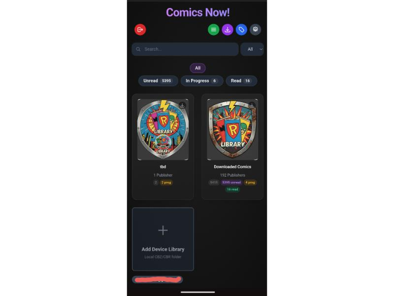
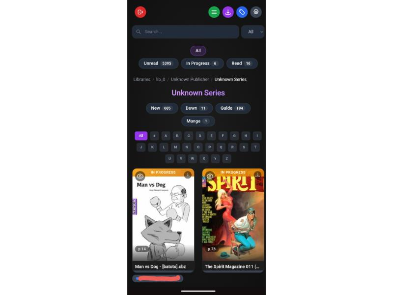
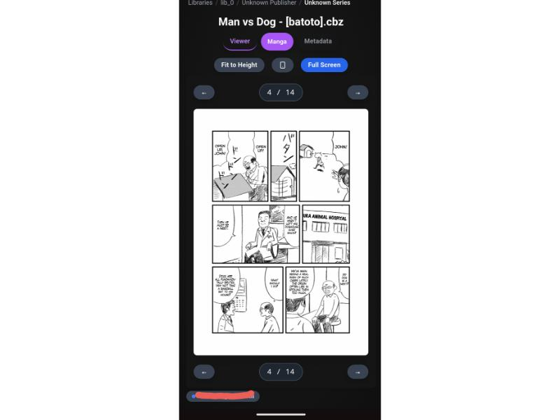
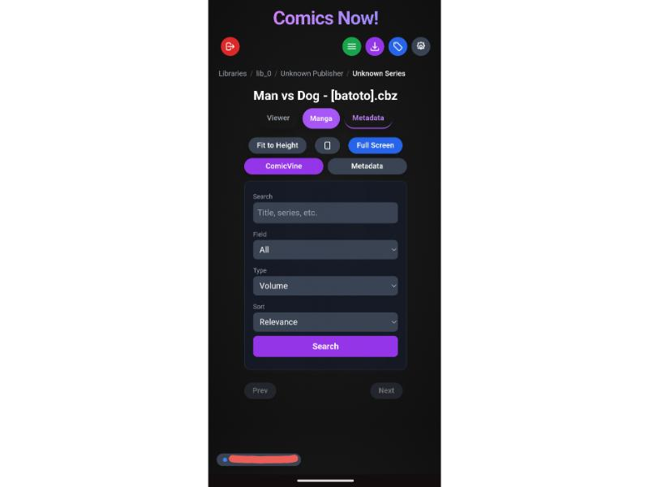
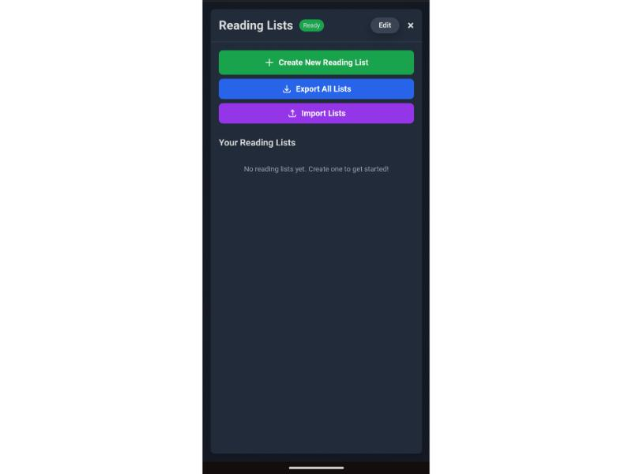
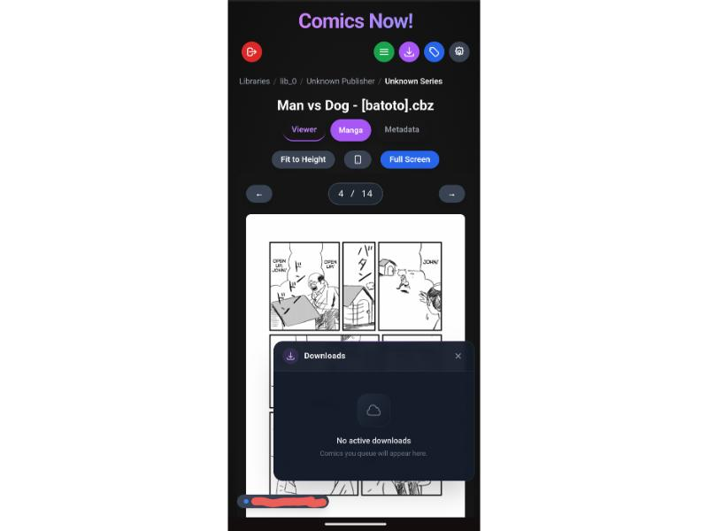
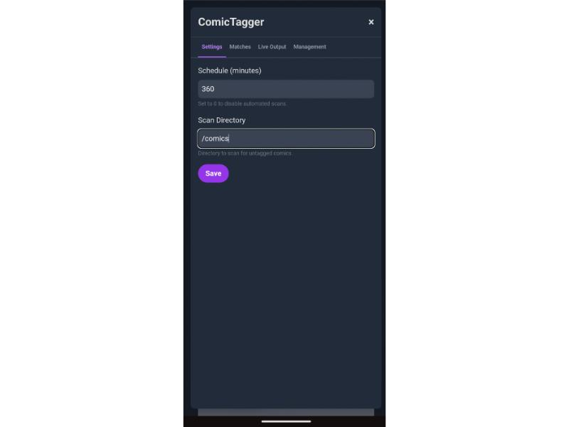
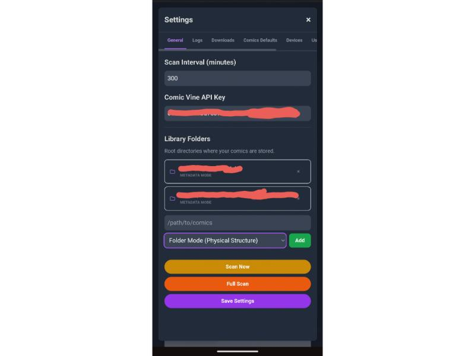

# Comics Now!

A modern, simple web app for managing and reading your digital comic book collection.

## Features

**Reading Experience**
- **Smart Guided View:** Automatically detects panels and speech bubbles for an immersive, panel-by-panel reading experience.
- **Reading Modes:** Choose from Standard, Continuous (vertical scrolling), Manga (right-to-left), Bubble, Hot Zoom, Landscape, and Full Image modes. Modes can be set per-comic, series, or publisher.
- **Progress Tracking & Sync:** Automatically saves your reading progress and syncs it across all your devices.
- **End-of-Comic Navigation:** Automatically prompts you to jump to the next issue when you finish reading.

**Library & Organization**
- **Library Structures:** Organize your server-side comics in two distinct ways:
  - **Metadata Mode:** Groups by Publisher → Series → Issue using `ComicInfo.xml` metadata.
  - **Folder Mode:** Mirrors your physical folder structure directly, ignoring internal metadata.
- **Local Device Library:** Read comics stored directly on your phone or computer without uploading them to the server.
- **Reading Lists:** Create custom collections and drag-and-drop reading orders for events or crossovers.
- **Bulk Management:** Easily mark entire series or publishers as read/unread.

**Format & Metadata Support**
- **Supported Formats:** Read CBZ and CBR files seamlessly.
- **Auto-Conversion:** Automatically converts PDF and CBR files to the more efficient CBZ format during scanning.
- **Metadata Management:** Integrates with ComicTagger to fetch rich metadata and covers from ComicVine. Metadata is written directly into the comic files as `ComicInfo.xml`.

**Offline & Sync**
- **Offline Reading:** Download individual comics, series, or entire reading lists to read without internet.
- **Background Downloads:** A reliable download queue that continues working even if you close the app.

**Administration**
- **Access Control:** Multi-user support with detailed access controls (e.g., share specific publishers or series with friends).
- **Secure Login:** Optional integration with Cloudflare Zero Trust for secure access.

## Installation & Setup

### Docker (Recommended)

The easiest way to run Comics Now! is with Docker. You can either use our pre-built image from the GitHub Container Registry (fastest) or build it locally.

#### Using Pre-built Image (Fastest)

1. **Download the configuration:**
   ```bash
   curl -O https://raw.githubusercontent.com/ComicsNow/comics-now/main/docker-compose.yml
   ```

2. **Configure:**
   Edit `docker-compose.yml` and replace `build: .` with `image: ghcr.io/comicsnow/comics-now:latest`. Then mount your comic libraries.
   ```yaml
   services:
     server:
       image: ghcr.io/comicsnow/comics-now:latest
       volumes:
         - ./data:/app/data
         - /path/to/your/comics:/comics:ro
   ```

3. **Start the service:**
   `docker compose up -d`

#### Building Locally
1. **Clone the repository:**
   `git clone <repository-url>`
   `cd comics-now`

2. **Configure:**
   Edit `docker-compose.yml` to mount your comic libraries.
   ```yaml
   volumes:
     - ./data:/app/data
     - /path/to/your/comics:/comics:ro  # Change this to your library path
   ```

3. **Start the service:**
   `docker compose up -d --build`

The app will be available at `http://localhost:3000`. Persistent data (database, config, and thumbnails) will be stored in the `./data` directory on your host.

### Manual Install (NPM)

1. **Clone the repository:**
   `git clone <repository-url>`
   `cd comics-now`

2. **Install system requirements:**
   - **Utilities (Ubuntu/Debian):** `sudo apt install poppler-utils zip unrar`
   - **Metadata Engine (Python):** `pip3 install "comictagger[all]"`

3. **Install app dependencies:**
   `npm install`

4. **Configure:**
   Copy the example config: `cp config.example.json config.json`
   Edit `config.json` to add your comic folders.

5. **Start:**
   `npm start`

Access the app in your browser at `http://localhost:3000`.

*See the `server/routes/api.js` file for full API documentation.*

## Gallery

### Demos


### Screenshots
| | | |
|:---:|:---:|:---:|
|  |  |  |
|  |  |  |
|  |  |  |

