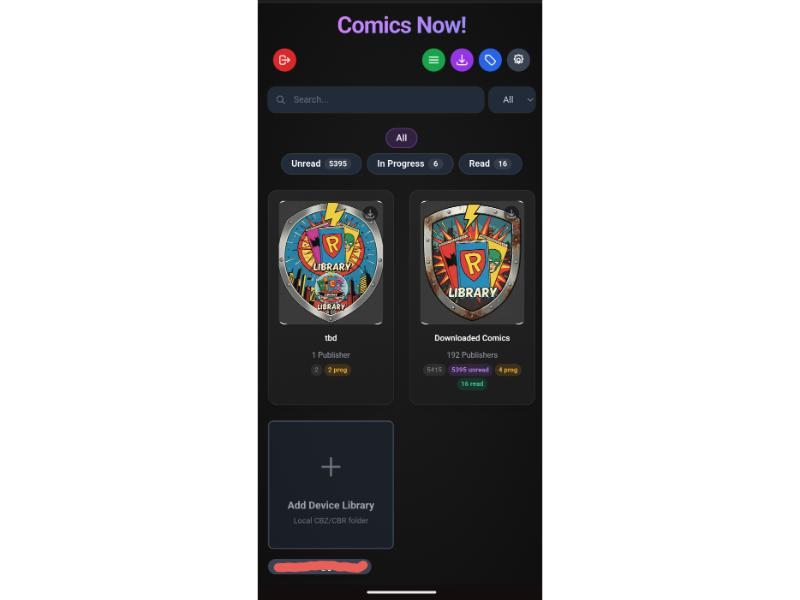
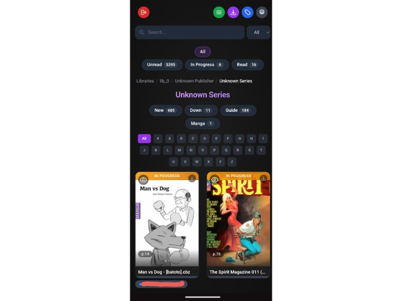
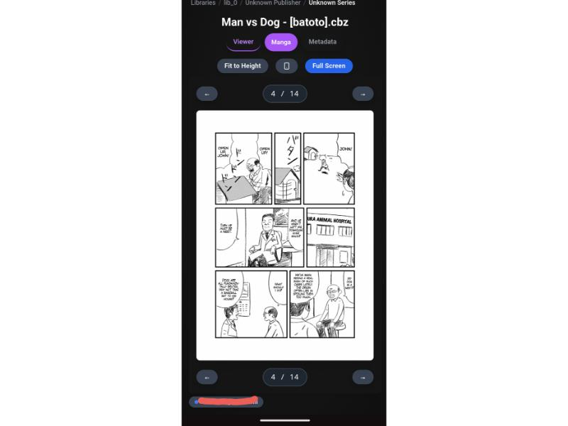
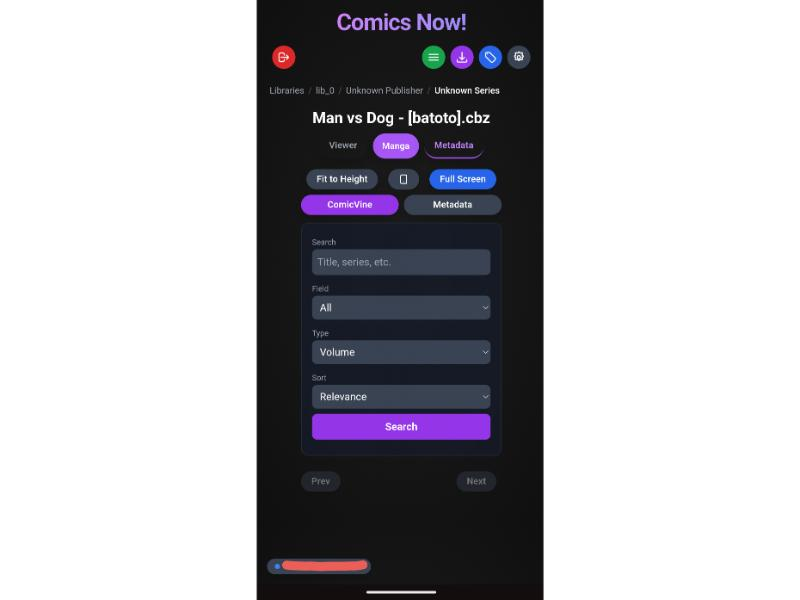
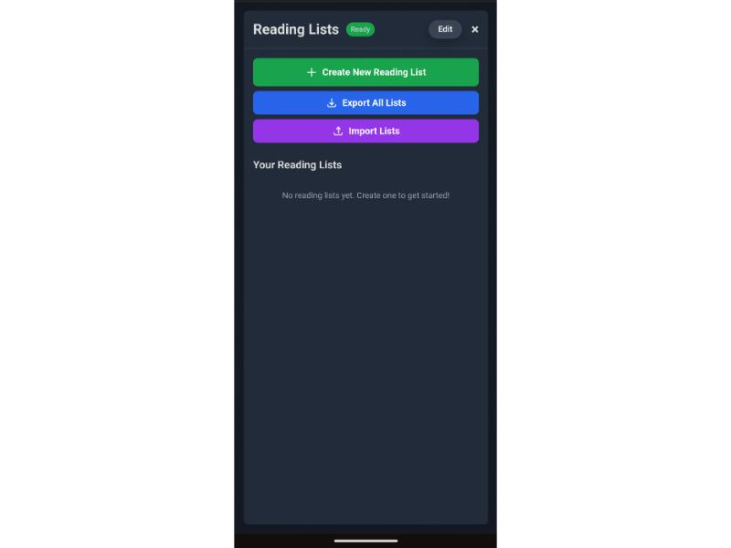
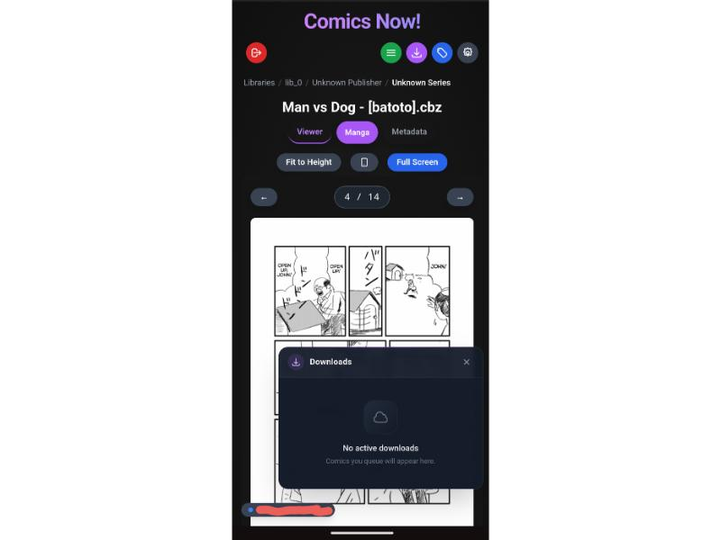
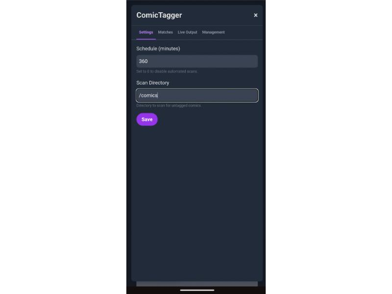
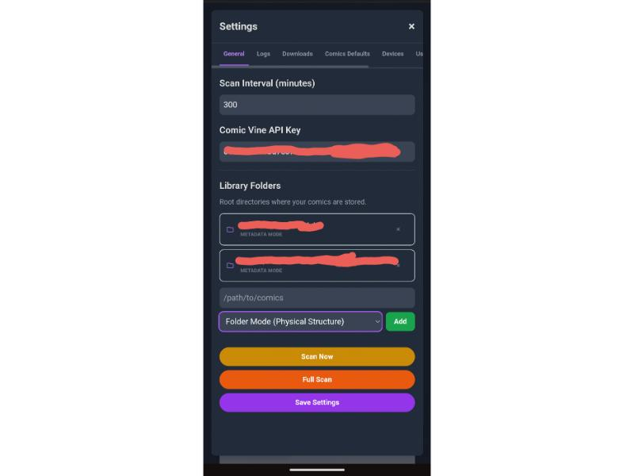

# Comics Now! 💥📚

<p align="center">
  <strong>The modern, self-hosted comic book library server, smart reader, and AI-augmented cataloging platform.</strong>
</p>

<p align="center">
  <a href="#quick-start-60-seconds"></a>
  <a href="https://github.com/ComicsNow/comics-now/pkgs/container/comics-now"></a>
  <a href="https://github.com/ComicsNow/comics-now/actions/workflows/docker-publish.yml"></a>
  <a href="https://github.com/ComicsNow/comics-now/actions/workflows/codeql.yml"></a>
  <a href="https://ko-fi.com/comicsnow"></a>
  <a href="docs/WIKI.md"></a>
  <a href="LICENSE"></a>
</p>

---

## ⚡ Why Comics Now!?

Most digital comic servers were built a decade ago as basic file browsers. **Comics Now!** re-imagines your comic library as a modern, intelligent web application designed for desktops, tablets, and phones:

* 🧠 **Smart Guided View**: Automatically detects panels and dialogue bubbles using deep learning neural networks (`western.onnx` and `manga.onnx`) for an immersive panel-by-panel reading experience.
* 🔄 **True Cross-Device Sync**: Pick up right where you left off. Reading progress syncs in real-time between your phone, tablet, and PC.
* 📱 **Installable Offline PWA**: Install Comics Now! to your iOS, iPadOS, Android, or desktop home screen. Queue comics in the background and read them completely offline without internet.
* 🏷️ **Multi-Source Metadata Tagger**: Built-in enrichment engine querying ComicVine, Metron, GCD, Goodreads, Amazon, and Google Books with perceptual cover image hashing and automatic file renaming/sorting.
* 🤖 **AI Model Context Protocol (MCP)**: Native Python MCP server allowing Claude, Cursor, and Gemini to curate reading lists, inspect cover art, and query your collection with natural language.
* 🛡️ **Cloudflare Zero Trust Ready**: Zero open ports needed. Full integration with Cloudflare Access JWT authentication, granular user permissions (down to publisher and series), and admin impersonation.
* 📂 **Metadata Mode & Folder Mode**: Organize your library by metadata tags (Publisher → Series → Issue) or mirror your physical directory tree directly.
* 💻 **Client-Side Local Reader**: Drag and drop local CBZ/CBR files directly into the browser to read instantly with WebAssembly—no file upload required.

---

## 🎬 Showcase

| AI Smart Guided View | Multi-Device Reader |
| :---: | :---: |
|  |  |

<details>
<summary>📸 <strong>Click to view UI Screenshots</strong></summary>

| | | |
|:---:|:---:|:---:|
|  |  |  |
|  |  |  |
|  |  |  |

</details>

---

## 🚀 Quick Start (60 Seconds)

### Option 1: Docker CLI (Fastest)

```bash
docker run -d \
  --name comics-now \
  -p 3000:3000 \
  -v $(pwd)/data:/app/data \
  -v /path/to/your/comics:/comics:ro \
  --restart unless-stopped \
  ghcr.io/comicsnow/comics-now:latest
```

Open [http://localhost:3000](http://localhost:3000) in your browser!

---

### Option 2: Docker Compose

Save as `docker-compose.yml`:

```yaml
services:
  comics-now:
    image: ghcr.io/comicsnow/comics-now:latest
    container_name: comics-now
    ports:
      - "3000:3000"
    environment:
      - NODE_ENV=production
      - DATA_DIR=/app/data
      - PORT=3000
    volumes:
      - ./data:/app/data
      - /path/to/your/comics:/comics:ro
    restart: unless-stopped
```

Launch with:
```bash
docker compose up -d
```

---

## 📖 Complete Documentation & Wiki

Looking for detailed setup guides, configuration tables, or workflow deep dives? Check out our comprehensive documentation manual:

👉 **[Read the Full Comics Now! Wiki Manual](docs/WIKI.md)**

### Manual Highlights:
- [Cloudflare Zero Trust & LAN Admin Configuration](docs/WIKI.md#3-cloudflare-zero-trust--authentication)
- [Granular Permissions & User Impersonation](docs/WIKI.md#4-user--administrator-management)
- [Metadata Mode vs. Folder Mode](docs/WIKI.md#5-libraries-folder-structures--scanning)
- [Sidecar vs. Database vs. Archive Write-Back](docs/WIKI.md#6-supported-formats-auto-conversion--metadata-storage)
- [Multi-Source Tagging & Auto-Renaming Engine](docs/WIKI.md#7-the-tagging-engine--file-organization)
- [Smart Guided View & Reading Modes (Continuous, Manga, Bubble Zoom)](docs/WIKI.md#8-smart-guided-view--reading-modes)
- [Curating & Syncing Reading Lists to All Users](docs/WIKI.md#9-reading-lists)
- [Progressive Web App (PWA) Offline Installation](docs/WIKI.md#10-devices-progress-syncing--offline-pwa)
- [UI Long-Press Context Menus & Actions](docs/WIKI.md#11-ui-navigation-views--long-press-menus)
- [Model Context Protocol (MCP) Setup for Claude & Cursor](docs/WIKI.md#13-model-context-protocol-mcp-server)

---

## 🤖 Model Context Protocol (MCP) Integration

Comics Now! includes a built-in Python MCP server (`mcp/`) that lets your AI coding assistant or desktop agent manage your collection:

```bash
# Add to Claude Code
claude mcp add comics-now -- /path/to/comics-now/mcp/run.sh

# Or start directly
npm run mcp
```

**What your AI agent can do:**
- 🔍 *"Create a chronological reading list for the Infinity Gauntlet event across all my comics."*
- 🎨 *"Inspect the cover of comic #412, verify the issue via web search, and tag the writer and artist."*
- 📊 *"Query SQLite for all unread Spider-Man comics published between 1985 and 1992."*

*(Read the [MCP Architecture & Setup Guide](mcp/README.md) for configuration details.)*

---

## 🛠️ Bare Metal Installation

If you prefer running without Docker on Debian / Ubuntu / Raspberry Pi OS:

```bash
# 1. Install prerequisites
sudo apt update
sudo apt install -y nodejs npm python3 python3-pip python3-venv poppler-utils zip unrar

# 2. Clone repository & install dependencies
git clone https://github.com/ComicsNow/comics-now.git
cd comics-now
npm install
npm run build

# 3. Configure environment
cp .env.example .env

# 4. Start server
npm start
```

---

## ❤️ Support Comics Now!

If Comics Now! helps you enjoy and organize your comic book collection, consider buying a coffee to support continued development:

[](https://ko-fi.com/comicsnow)

---

## 🤝 Contributing

Contributions, feature requests, and bug reports are warmly welcome!
1. Fork the repository.
2. Create your feature branch (`git checkout -b feature/amazing-feature`).
3. Run automated tests (`npm test`).
4. Commit your changes (`git commit -m 'feat: add amazing feature'`).
5. Push to your branch and open a Pull Request.

---

## 📄 License

Comics Now! is free and open-source software licensed under the **GNU Affero General Public License v3.0** (`AGPL-3.0`). See the [LICENSE](LICENSE) file for details.
